<h1 align="center">📝 ✏️Kanban Task Management</h1>

<h4 align="center">
    This project is a challenge that I took from <a href="https://www.frontendmentor.io/challenges/kanban-task-management-web-app-wgQLt-HlbB">frontendmentor.io </a> 
    which consists of building a responsible kanban task management website 
    where you can create boards, columns, tasks and subtasks and manage all of them with  
    a drag and drop system! You must create an account to save all of your work inside of this website.  
     ( it's not necessary to use a valid email)  
</h4>
 

<h4 align="center">
    <a align="center" href="https://www.frontendmentor.io/challenges/kanban-task-management-web-app-wgQLt-HlbB/hub">Front-end mentor challenge.</a> //
     <a align="center" href="https://kanban-task-management-kappa.vercel.app/">Kanban Task Management Website</a>
</h4>

 

<h6 align="center"> This project was created with:</h6>
 
 

    
    
    
    
    
    
 

  

<!-- Web -->
<h2 align="center">Web Version 🖥️ Light mode ☀️</h2>

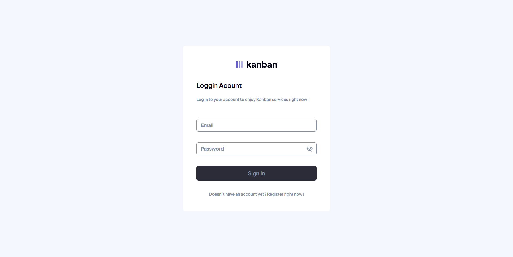
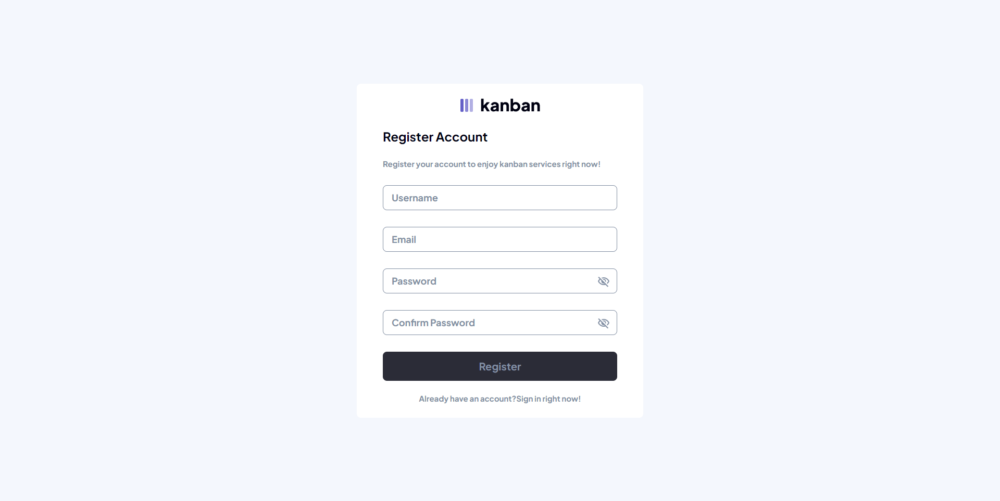
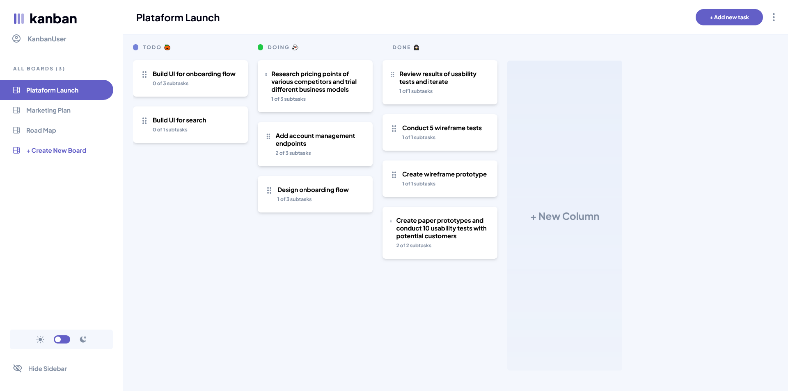
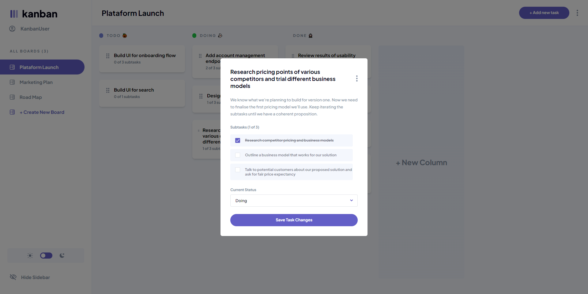
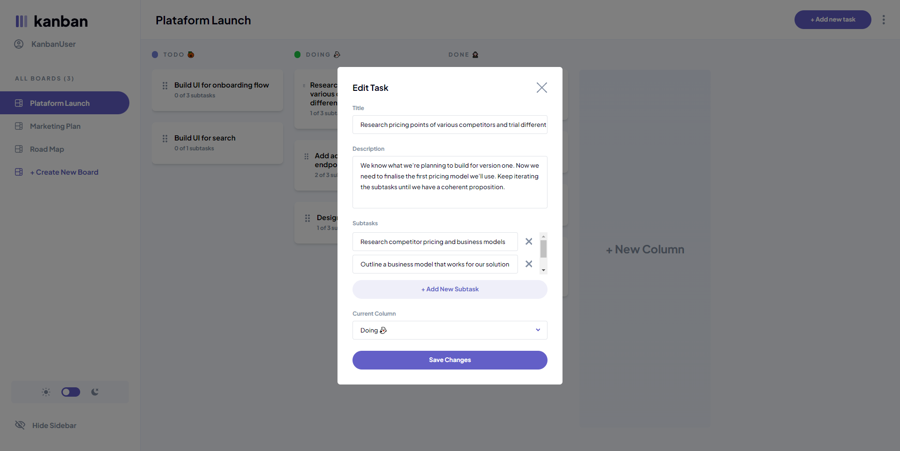
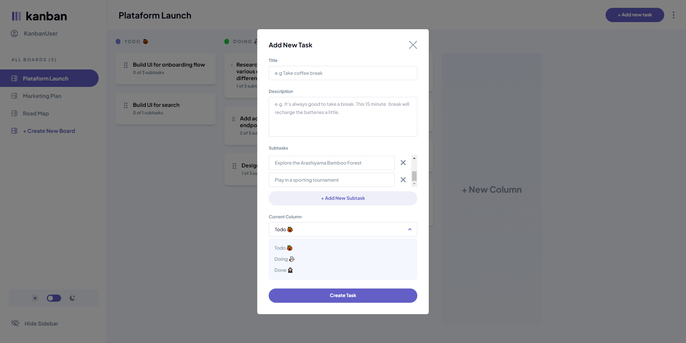
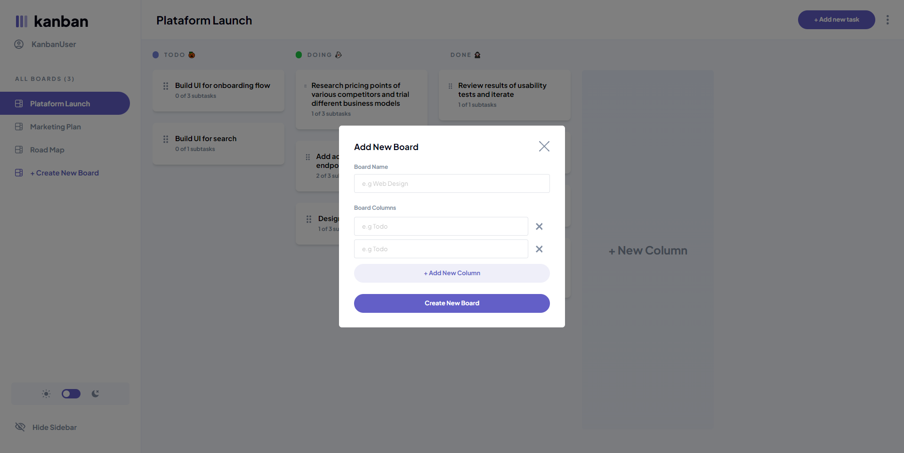

<h2 align="center">Web Version 🖥️ Dark mode 🌙 </h2>

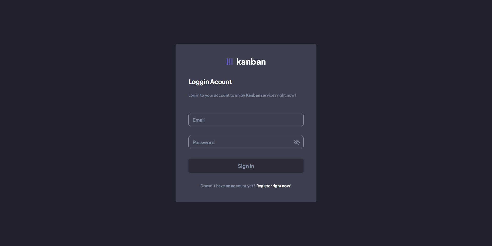
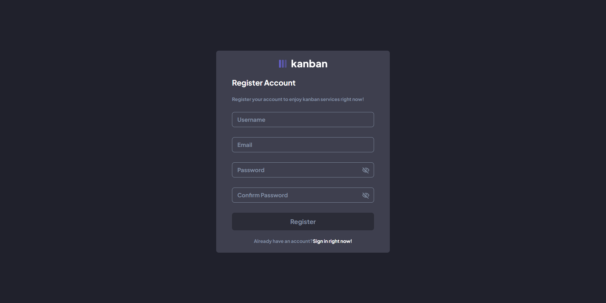
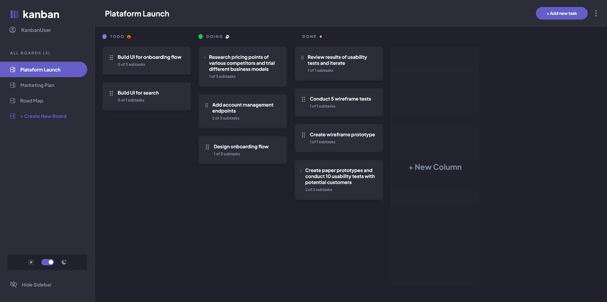
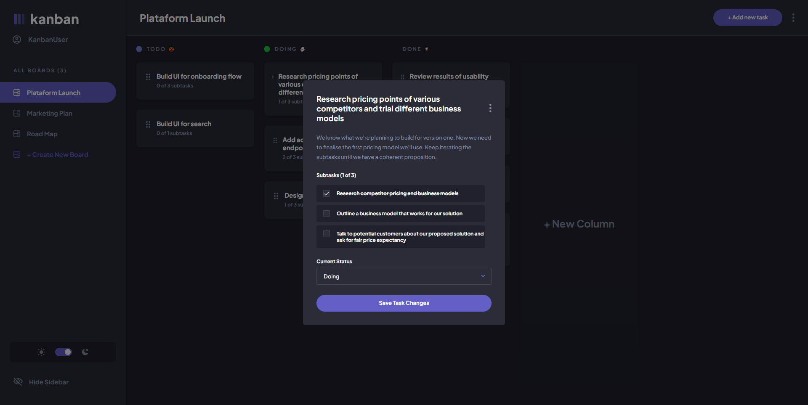
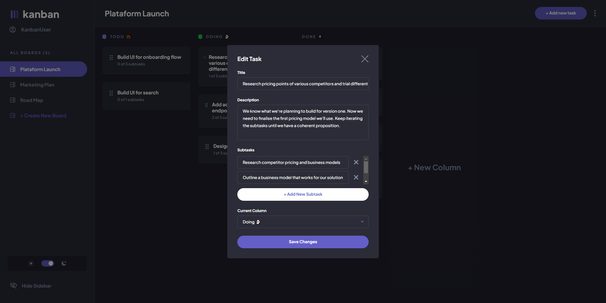
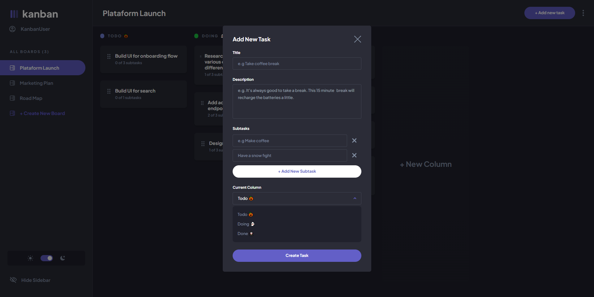
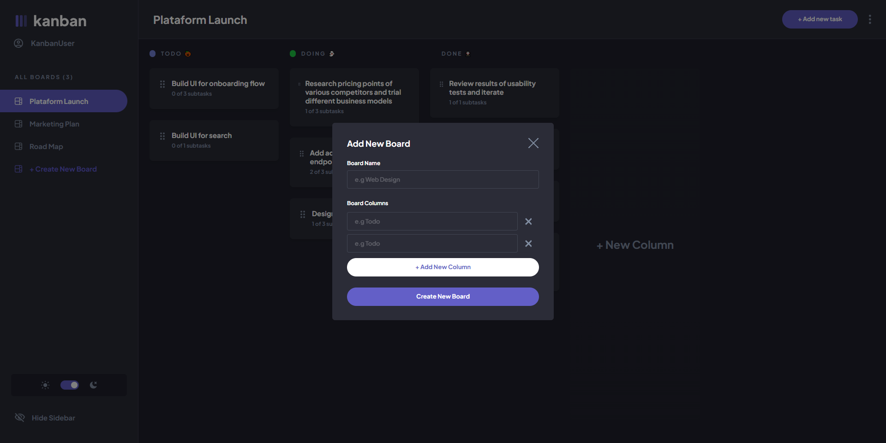

<!-- Mobile -->
<h2 align="center">Mobile Version 📱 Light mode ☀️</h2>
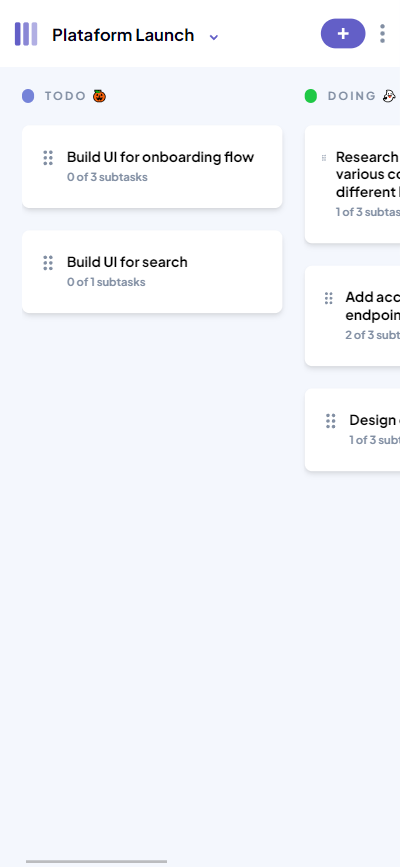
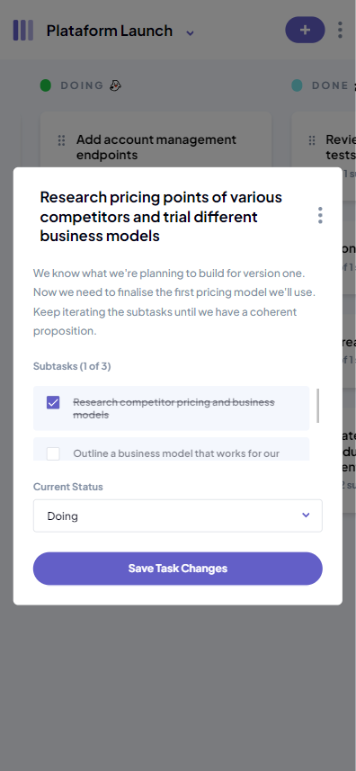
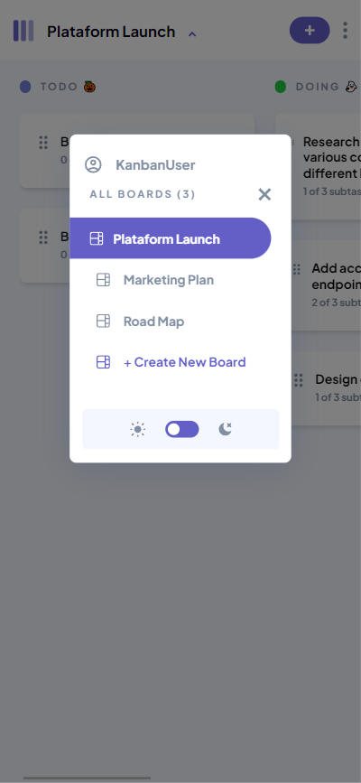

<h2 align="center">Mobile Version 📱 Dark mode 🌙</h2>
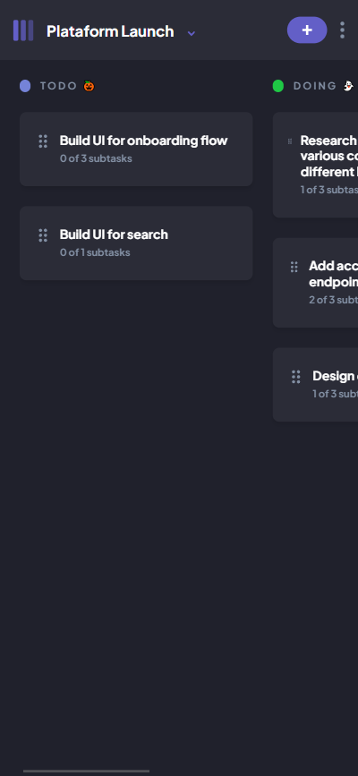
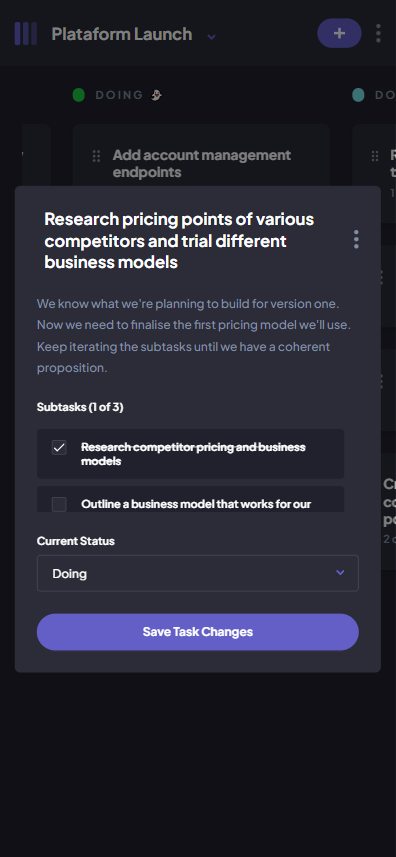
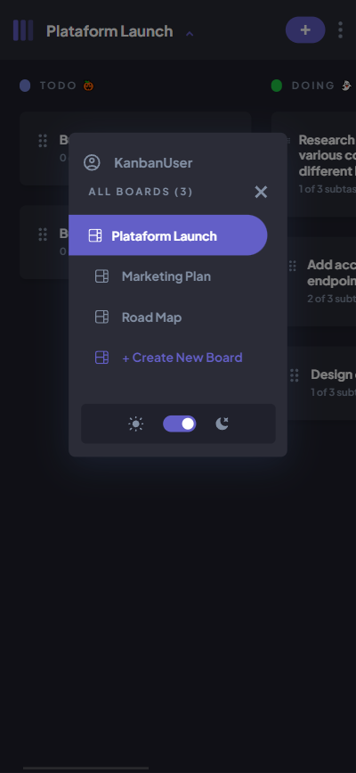

<!--Made By Gustavo J. Souza -->
